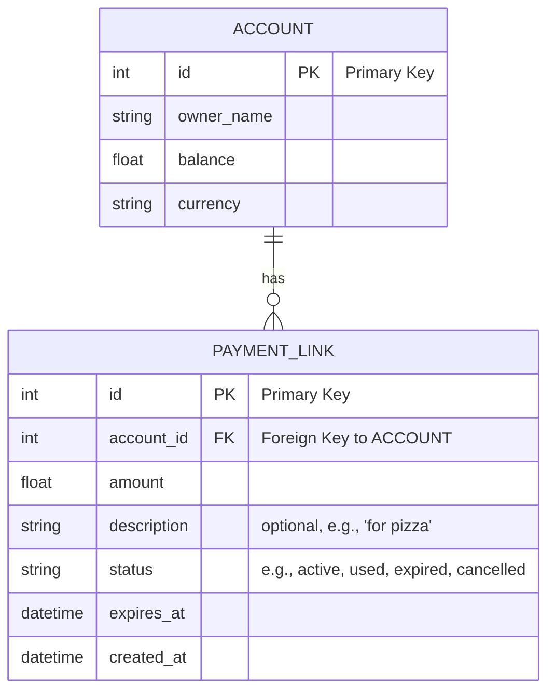
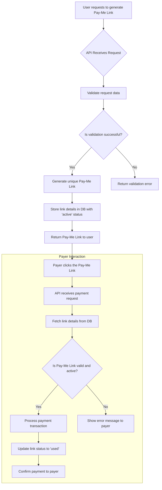
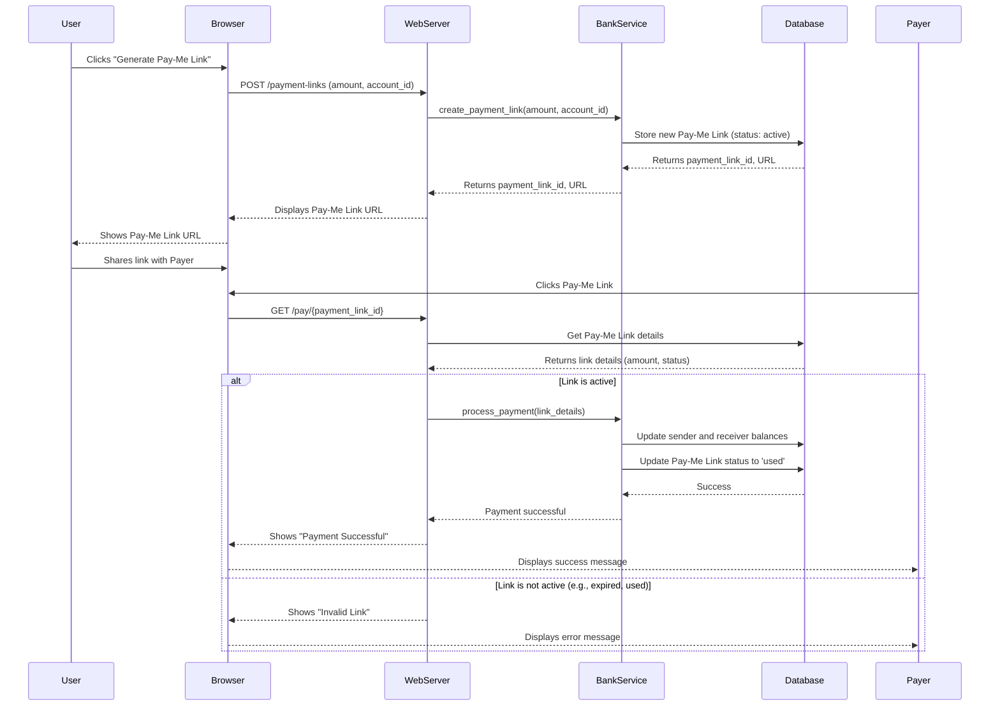
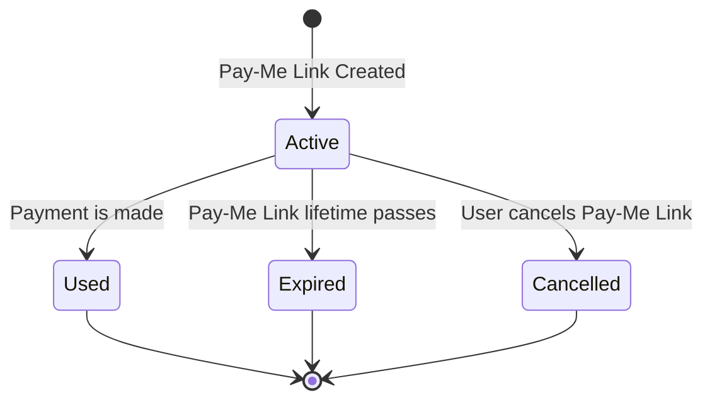

# Pay-Me Link Feature: Structured Requirements

## 1. Core User Story

As a user, I want to easily generate a unique Pay-Me Link to request a payment from someone, so that I can get paid back quickly and effortlessly.

## 2. High-Level Flow

1.  **Request Generation (Alex):**
    *   Alex navigates to a prominent "Generate Pay-Me Link" button within the HappyBank app.
    *   He enters the desired amount (e.g., 250 CZK) and an optional short description (e.g., "for pizza").
    *   The app generates a unique, shareable Pay-Me Link.
2.  **Payment Execution (Betty):**
    *   Betty receives and clicks the link.
    *   The link opens her HappyBank mobile app directly to a pre-filled payment confirmation screen.
    *   The screen clearly displays: "Alex is requesting 250 CZK for 'pizza'."
    *   Betty authenticates seamlessly within her already-logged-in app session and taps a single "Pay" button.
    *   The payment is executed.

## 3. Functional Requirements

### 3.1. Link Generation

*   **FR1.1:** The app MUST provide a clear and easily accessible entry point to generate a Pay-Me Link (e.g., next to the "Pay" button on the main account screen).
*   **FR1.2:** Users MUST be able to specify a payment amount.
*   **FR1.3:** Users SHOULD be able to add a short, optional text description to the request.
*   **FR1.4:** The app MUST generate a unique URL for each Pay-Me Link request.
*   **FR1.5:** The app MUST provide easy options to copy the Pay-Me Link or share it via standard OS sharing functionalities.

### 3.2. Link Reception and Payment

*   **FR2.1:** Clicking the Pay-Me Link on a mobile device MUST attempt to open the HappyBank app.
*   **FR2.2:** If the user is authenticated in the app, it MUST display a pre-filled payment screen with the requester's name, amount, and description.
*   **FR2.3:** The payment screen MUST have a clear, single call-to-action "Pay" button.
*   **FR2.4:** The payment process MUST be secure, leveraging the user's existing app authentication. No separate login should be required if the user is already logged into the app.

## 4. Non-Functional Requirements

### 4.1. User Experience (UX)

*   **NFR1.1:** The entire process should feel modern, seamless, and frictionless, with minimal taps.
*   **NFR1.2:** All screens must be clean, simple, and display information clearly, avoiding banking jargon.

### 4.2. Security & Business Rules

*   **NFR2.1:** The Pay-Me Link MUST be for a single use only.
*   **NFR2.2:** The Pay-Me Link MUST expire after a set period (e.g., 24 hours).
*   **NFR2.3:** There MUST be a maximum limit for the requested amount (e.g., 10,000 CZK).
*   **NFR2.4:** There SHOULD be a minimum limit for the requested amount (e.g., 10 CZK).

## 5. MVP for Friday Demo

The goal for the end-of-week demo is a clickable prototype or a partially functional version that demonstrates the "happy path" of the core user flow. Backend processing can be simulated.

*   **Scope:**
    *   UI for generating a Pay-Me Link (entering amount).
    *   A placeholder link is generated.
    *   A mechanism to simulate clicking the Pay-Me Link that leads to...
    *   A pre-filled payment confirmation screen in the app.
    *   A "Pay" button that shows a success confirmation.
*   **Out of Scope for Demo:**
    *   Actual backend payment processing.
    *   Pay-Me Link expiration and usage limits.
    *   Complex error handling.

## 6. Diagrams

### Entity-Relationship Diagram

### Flowchart

### Sequence Diagram

### State Diagram

